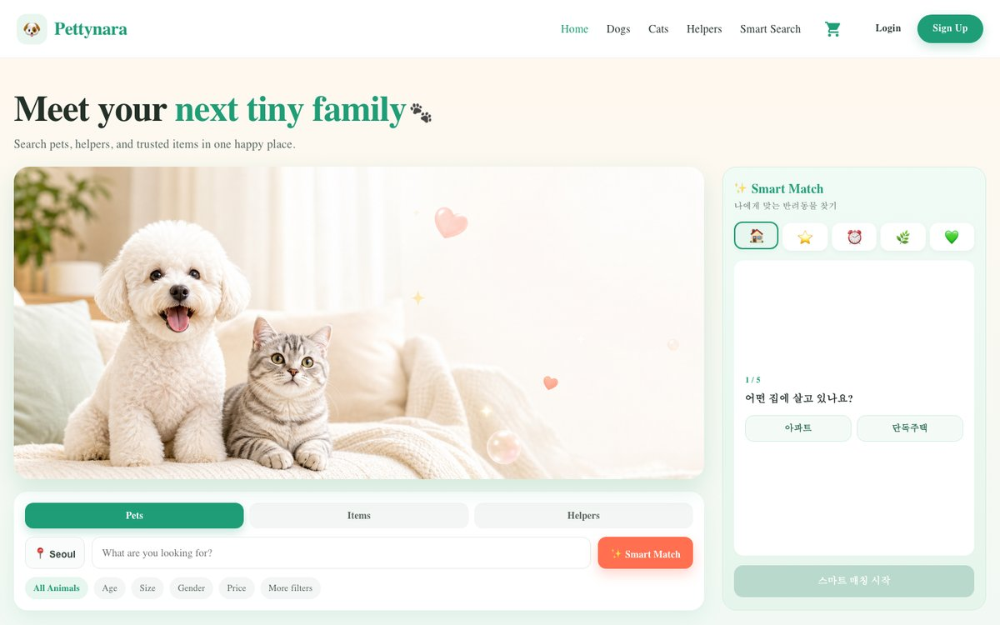
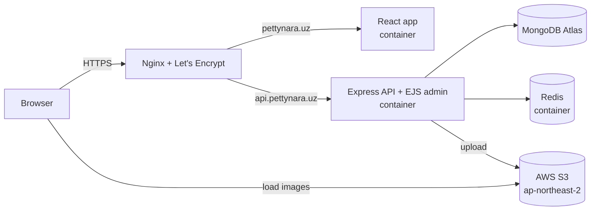

# Pettynara API

REST API and admin panel for **Pettynara**, an online pet shop where customers browse pets and pet supplies, like products, and place orders.

**Live:** [pettynara.uz](https://pettynara.uz) · **API:** [api.pettynara.uz](https://api.pettynara.uz) · **Frontend repo:** [pettynara-react](https://github.com/qazakhi515/pettynara-react)

[](https://github.com/qazakhi515/pettynara/actions/workflows/ci.yml)


> **한국어 요약**
> Pettynara는 반려동물과 반려용품을 판매하는 온라인 펫샵의 백엔드입니다. Node.js · Express · TypeScript · MongoDB로 REST API와 EJS 관리자 페이지를 구현했고, 상품 이미지는 AWS S3에 저장합니다. Docker Compose와 Nginx로 VPS에 배포했으며 HTTPS(Let's Encrypt)를 적용했습니다.



More screenshots are in the [frontend repo](https://github.com/qazakhi515/pettynara-react#screenshots).

## Features

- **Members:** sign up, log in and log out with a JWT stored in a cookie; profile update with avatar upload.
- **Products:** list with pagination, category filter, search and sorting; product detail with a per-member view count.
- **Likes:** like and unlike products on the server, with a sync endpoint that merges likes made before logging in.
- **Orders:** create an order from the basket, list orders by status, and move an order through `PAUSE → PROCESS → FINISH`. Members earn points when an order is paid.
- **Top users:** members ranked by points.
- **Admin panel (EJS):** session-based login; create products with up to 5 images, change product status, manage users.
- **Image storage:** uploads go to AWS S3 (local disk in development), images only, 5 MB per file.
- **Rate limiting:** login and signup are limited per IP and per nick to stop password guessing.
- **Caching:** product lists and the top-users ranking are cached in Redis for 60 seconds.

## Architecture



The apps and Redis run as Docker containers on one VPS. Redis has no published port at all, and the app ports are bound to `127.0.0.1`, so the only way in from the internet is through Nginx, which terminates HTTPS and puts an extra HTTP Basic Auth layer in front of `/admin`.

## Tech stack

| Area | Tools |
|---|---|
| Runtime | Node.js 20, TypeScript 5 |
| Web | Express 4, EJS (admin panel), Multer |
| Data | MongoDB Atlas, Mongoose |
| Auth | JWT in a cookie (API), `express-session` with a Redis store (admin) |
| Cache and limits | Redis 7, `ioredis`, `rate-limiter-flexible`, `connect-redis` |
| Storage | AWS S3 via `@aws-sdk/client-s3` |
| Testing | Jest, Supertest, mongodb-memory-server, GitHub Actions |
| Ops | Docker multi-stage build, Docker Compose, Nginx, Certbot |

## Project structure

```
src/
├── server.ts            # loads env, connects MongoDB, starts the server
├── app.ts               # middleware, sessions, views, routers
├── router.ts            # REST API used by the React app
├── router-admin.ts      # EJS admin panel routes (/admin)
├── controllers/         # request handling
├── models/              # services: business logic and database access
├── schema/              # Mongoose schemas
├── libs/                # config, errors, enums, types, Redis, upload, S3, cache and rate-limit utils
├── scripts/             # one-off maintenance scripts
└── views/, public/      # admin panel templates and assets
tests/                   # API tests (Jest + Supertest)
```

## API

| Method | Path | Auth | Description |
|---|---|---|---|
| POST | `/member/signup` | | Create an account (5 per IP per hour) |
| POST | `/member/login` | | Log in, sets the `accessToken` cookie (see rate limits) |
| POST | `/member/logout` | ✔ | Log out |
| GET | `/member/detail` | ✔ | Current member |
| POST | `/member/update` | ✔ | Update profile and avatar (`multipart/form-data`) |
| GET | `/member/top-users` | | Members ranked by points |
| GET | `/member/restaurant` | | Store (admin) profile |
| GET | `/member/likes` | ✔ | Products the member liked |
| POST | `/member/likes/sync` | ✔ | Merge likes made before login |
| GET | `/product/all` | | List: `page`, `limit`, `order`, `productCollection`, `search` |
| GET | `/product/:id` | optional | Product detail, counts a view for logged-in members |
| POST | `/product/:id/like` | ✔ | Toggle like |
| POST | `/order/create` | ✔ | Create an order from basket items |
| GET | `/order/all` | ✔ | Member's orders by status |
| POST | `/order/update` | ✔ | Change order status (owner only) |

## Testing

```bash
npm test
```

98 tests call the API over HTTP with Supertest and run against an in-memory MongoDB (`mongodb-memory-server`), so they need no setup and never touch a real database. They cover authentication, products, orders, likes, profile updates, uploads, the admin guard, rate limits, caching and admin sessions. GitHub Actions runs the build and then the tests twice: without Redis, and with a Redis service container where the Redis-only tests also run.

Writing the tests surfaced several bugs, each fixed in its own commit with a test that reproduces it:

| Bug | Impact | Fix |
|---|---|---|
| Order prices came from the client | A direct API call could buy a 200,000 KRW pet for 1 KRW | Prices are read from the database; quantities and products are validated |
| Signup and profile update saved the whole request body | Anyone could register as `ADMIN`, set their own points, or store an unhashed password | Only allowed fields are accepted |
| Order status could be set freely | Re-paying an order earned unlimited points; orders could skip payment | Only valid status changes are allowed, and payment succeeds once |
| Search text went straight into `RegExp` | `(` returned a 500; crafted patterns could stall the regex engine | Search input is escaped |
| A typo in the member status filter; top users sorted ascending | Blocked members kept access to their profile; the "top" list showed the lowest scores | Corrected the filter and the sort |
| Missing `page`/`limit`, malformed ids and rejected uploads | 500 errors for client mistakes | Defaults and limits, 404 for bad ids, 400 for bad files |

## Redis

Redis is optional: with `REDIS_URL` unset the app still runs, keeping rate limits and admin sessions in memory and caching nothing. That keeps local development and the default test run free of extra services.

| Use | Keys | Details |
|---|---|---|
| Rate limiting | `rl:*` | Login: 5 wrong passwords per IP and nick in 15 minutes (cleared by a successful login) and 20 attempts per IP in 15 minutes. Signup: 5 per IP per hour. Over the limit the API answers `429` with `Retry-After`. |
| Cache | `cache:*` | `GET /product/all` (per query) and `GET /member/top-users`, 60-second TTL. Product detail is not cached because every view updates its count. |
| Admin sessions | `sess:*` | `connect-redis`, expiring with the 3-hour cookie. |

- **Cache invalidation with a version key.** Product lists are cached per filter, search, sort and page, so one edit would touch many keys. Each key includes `cache:products:version`; an admin edit increments it, the old keys are never read again and expire on their own. No key scanning is needed.
- **Failure modes.** Commands fail fast instead of queueing, so if Redis goes down the cache is skipped and pages load from MongoDB. Rate limiters fall back to an in-memory copy rather than letting every request through. Admin login needs Redis.
- **Real client IPs.** Behind Nginx every request comes from `127.0.0.1`, which would put all users in one rate-limit bucket. `trust proxy` is set to one hop, so `req.ip` is the address Nginx appends to `X-Forwarded-For`, and a client cannot spoof it by sending its own header.
- **Deployment.** Redis runs as `redis:7-alpine` in Docker Compose with no published port, a 64 MB limit and `volatile-lru` eviction; every key except the cache version has a TTL.

## Engineering notes

- **Moving uploads to S3.** Images used to live on the server's disk, which made every server move a manual copy and blocked running more than one instance. Uploads now go to S3 through a Multer middleware that keeps the controller contract (`file.path`) unchanged. Existing images were moved with a re-runnable script ([`src/scripts/migrateUploadsToS3.ts`](src/scripts/migrateUploadsToS3.ts)): dry run first, then `--apply`, then a check that all 28 URLs return 200. The IAM user can only put, get and delete objects in this one bucket.
- **Order ownership.** `findByIdAndUpdate` ignores everything in the filter except `_id`, so the "only the owner can update" check was silently skipped. It now uses `findOneAndUpdate({ _id, memberId })`.
- **Likes on the server.** Likes used to exist only in the browser. They are now stored per member, with a sync endpoint that merges likes made while logged out.
- **Points don't block orders.** Awarding points is wrapped separately, so a failure there can't roll back a paid order.
- **Sessions only where needed.** The session middleware is mounted on `/admin` only; mounted globally, it wrote a session document to the database on every anonymous API request. Sessions moved from MongoDB to Redis.

## Getting started

Requirements: Node.js 20+, a MongoDB connection string.

```bash
git clone https://github.com/qazakhi515/pettynara.git
cd pettynara
npm install
cp .env.example .env    # then fill in the values
npm run start:dev       # http://localhost:3003, admin at /admin
```

To run with Redis locally, start it with Docker and set `REDIS_URL=redis://localhost:6379` in `.env`:

```bash
docker run -d --name redis -p 6379:6379 redis:7-alpine
```

| Variable | Required | Description |
|---|---|---|
| `PORT` | | Default `3003` |
| `MONGO_URL` | ✔ | MongoDB connection string |
| `SESSION_SECRET` | ✔ | Admin session secret |
| `SECRET_TOKEN` | ✔ | JWT signing secret |
| `AWS_REGION`, `AWS_S3_BUCKET` | | Enable S3 uploads; without them files go to `./uploads` |
| `AWS_ACCESS_KEY_ID`, `AWS_SECRET_ACCESS_KEY` | | Credentials for S3 (not needed with an instance role) |
| `REDIS_URL` | | Enables Redis, for example `redis://localhost:6379`; see [Redis](#redis) |

| Script | Description |
|---|---|
| `npm run start:dev` | Run with nodemon and ts-node |
| `npm run build` | Compile TypeScript to `dist/` |
| `npm start` | Run with ts-node |
| `npm test` | Run the test suite; with `REDIS_URL` set, the Redis tests run too |

## Deployment

```bash
docker compose up -d --build
```

The image is a two-stage build: TypeScript is compiled in the first stage, and the runtime image contains only `dist/` and production dependencies. Secrets come from `.env` through `env_file` and are never baked into the image. The Nginx site config is in [`deploy/pettynara.conf`](deploy/pettynara.conf).

## Roadmap

- [x] Automated tests (Jest + Supertest) and CI with GitHub Actions
- [ ] Schema-based request validation and a central error handler
- [ ] Node.js 22 base image
- [ ] Serve images through CloudFront and close public bucket access
- [ ] Kakao login and Toss Payments

## Background

Pettynara started from a bootcamp e-commerce project for a restaurant. I migrated the domain to a pet shop and extended it with the features and infrastructure described above: server-side likes, S3 storage, the order ownership fix, Docker and Nginx deployment with HTTPS, and the redesigned admin panel.

## Author

**Akhmadjon Usmonov** · [GitHub](https://github.com/qazakhi515)
